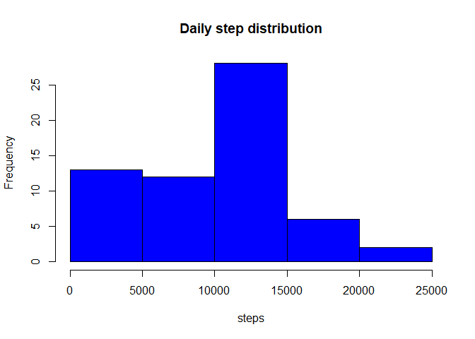
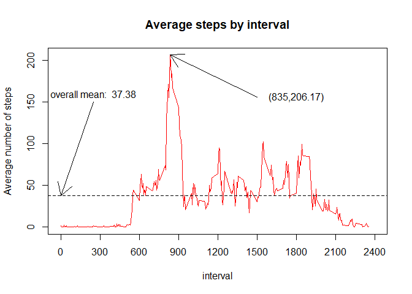
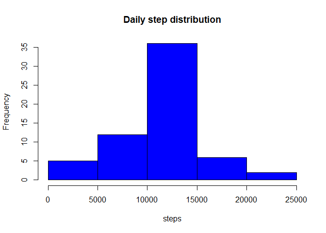
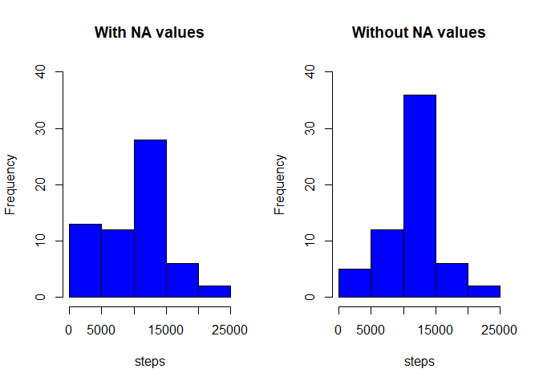
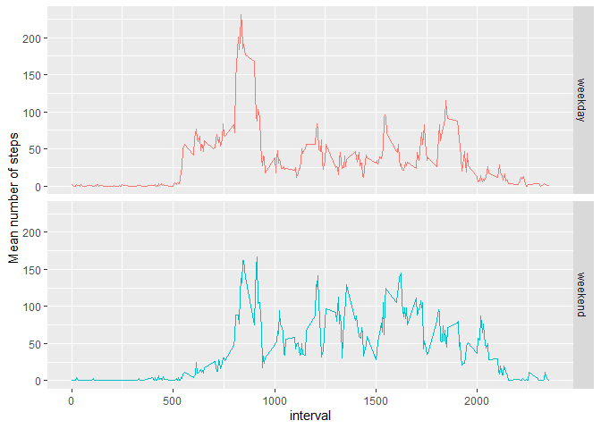

<!-- make sure code and output is echoed. adjust scientific notation -->


### Examining and Understanding the dataset.

Examining the provided data set, it is apparent that the data is comma separated and
contains headers. Within the dataset there are 17568 observations, each spanning over 3 columns. For each column, the following data types and observations are inferred:

* ***steps:*** numeric/integer.  This is the number of steps taken in a particular five minute time interval.  NA values are present in the data. The source of these is unknown but a logical assumption is either a data recording error occurred or that there were 0 steps taken in that period.  The presence of 0s elsewhere in the data indicate that the former is more likely.  The frequency and impact of these NAs will be explored further in the coming analysis. 

* ***date:*** Date. Date,in YYYY-MMM-DD format, for which the data was recorded. 61 unique values ranging from Oct 1, 2012 to Nov 30, 2012 are present, covering each day of the 2 month period of interest.

* ***interval***: numeric/integer.  Identifies which 5 minute interval the data was measured. 288 unique values ranging from 0 to 2355.

### Loading the dataset.###

With the file format and data types determined, we begin importing the data.

```r
act_data <- read.csv('data/activity.csv', colClasses = c('numeric', 'Date', 'numeric'))
```

### Examining the number of daily steps.
We begin our analysis by examining some of the statistics (mean, median) related to the total number of steps taken on a daily basis.  To gain an understanding of the distribution of these total number of steps, we compute the total number of steps taken for each day and plot the cooresponding histogram.


```r
daily_steps<- tapply(act_data$steps,act_data$date,sum,na.rm=TRUE)
hist(daily_steps,col="blue",main="Daily step distribution",xlab ="steps")
```

<!-- -->

From our daily steps, we look compute a few key measures of central tendency, the mean and the median.


```r
daily_mean <- mean(daily_steps)
daily_median <- median(daily_steps)
print(daily_mean)
```

```
## [1] 9354.23
```

```r
print(daily_median)
```

```
## [1] 10395
```

```r
summary(daily_steps)
```

```
##    Min. 1st Qu.  Median    Mean 3rd Qu.    Max. 
##       0    6778   10395    9354   12811   21194
```

From the analysis, we observe that the mean of the total daily steps is 9354.2295082, while the median of this data is 10395.  Also we see that there were a minimum of 0 steps taken and a maximum of 21194 taken over the course of the two month period. 

### Examining steps by the interval.

Next, we shift our focus to exploring the activity data over each interval.  For each interval we obtain the mean steps over the entire two month period. 


```r
five_min <- tapply(act_data$steps,act_data$interval,mean,na.rm=TRUE)
five_min_mean <- mean(five_min)
five_min_max <- max(five_min)
intervals <- unique(act_data$interval)
max_int <- intervals[ five_min == five_min_max ]
print(five_min_max)
```

```
## [1] 206.1698
```

```r
print(max_int)
```

```
## [1] 835
```

reveals that the maximum average number of steps is 206.1698113 and occurs at 835 minutes into the observation period.  We summarize this data in the below time series plot (The mean of the time series data is shown for reference).


```r
plot(intervals,five_min,type='l',col="red",main = "Average steps by interval",
     xlab="interval", ylab="Average number of steps",xlim=c(0,2400),xaxt='n')
abline(h=five_min_mean,lty=2)
arrows(250,150,0,mean(five_min))
text(250,160,paste("overall mean: ",as.character(round(five_min_mean,2))))
arrows(1500,five_min_max-50,max_int,five_min_max)
text(1800,five_min_max-50, paste0("(",as.character(max_int),",",as.character(round(five_min_max,3)),")")   )
axis(1,at=seq(0,2400,300))
```

<!-- -->


### A look at the missing data from our dataset.

Inspection of the data reveals that there are numerous rows in which the step count is NA.  In particular,


```r
na_count <- sum( is.na(act_data))
apply(is.na(act_data),2,sum) 
```

```
##    steps     date interval 
##     2304        0        0
```
there are 2304 NA values which occur completely within the step count column.  We examine further to determine where these NA values are located in the dataset.


```r
na_by_interval <- tapply(is.na(act_data$steps),act_data$interval,sum)
na_by_dates <- tapply(is.na(act_data$steps),act_data$date,sum)
na_by_interval[na_by_interval > 0]
```

```
##    0    5   10   15   20   25   30   35   40   45   50   55  100  105  110  115 
##    8    8    8    8    8    8    8    8    8    8    8    8    8    8    8    8 
##  120  125  130  135  140  145  150  155  200  205  210  215  220  225  230  235 
##    8    8    8    8    8    8    8    8    8    8    8    8    8    8    8    8 
##  240  245  250  255  300  305  310  315  320  325  330  335  340  345  350  355 
##    8    8    8    8    8    8    8    8    8    8    8    8    8    8    8    8 
##  400  405  410  415  420  425  430  435  440  445  450  455  500  505  510  515 
##    8    8    8    8    8    8    8    8    8    8    8    8    8    8    8    8 
##  520  525  530  535  540  545  550  555  600  605  610  615  620  625  630  635 
##    8    8    8    8    8    8    8    8    8    8    8    8    8    8    8    8 
##  640  645  650  655  700  705  710  715  720  725  730  735  740  745  750  755 
##    8    8    8    8    8    8    8    8    8    8    8    8    8    8    8    8 
##  800  805  810  815  820  825  830  835  840  845  850  855  900  905  910  915 
##    8    8    8    8    8    8    8    8    8    8    8    8    8    8    8    8 
##  920  925  930  935  940  945  950  955 1000 1005 1010 1015 1020 1025 1030 1035 
##    8    8    8    8    8    8    8    8    8    8    8    8    8    8    8    8 
## 1040 1045 1050 1055 1100 1105 1110 1115 1120 1125 1130 1135 1140 1145 1150 1155 
##    8    8    8    8    8    8    8    8    8    8    8    8    8    8    8    8 
## 1200 1205 1210 1215 1220 1225 1230 1235 1240 1245 1250 1255 1300 1305 1310 1315 
##    8    8    8    8    8    8    8    8    8    8    8    8    8    8    8    8 
## 1320 1325 1330 1335 1340 1345 1350 1355 1400 1405 1410 1415 1420 1425 1430 1435 
##    8    8    8    8    8    8    8    8    8    8    8    8    8    8    8    8 
## 1440 1445 1450 1455 1500 1505 1510 1515 1520 1525 1530 1535 1540 1545 1550 1555 
##    8    8    8    8    8    8    8    8    8    8    8    8    8    8    8    8 
## 1600 1605 1610 1615 1620 1625 1630 1635 1640 1645 1650 1655 1700 1705 1710 1715 
##    8    8    8    8    8    8    8    8    8    8    8    8    8    8    8    8 
## 1720 1725 1730 1735 1740 1745 1750 1755 1800 1805 1810 1815 1820 1825 1830 1835 
##    8    8    8    8    8    8    8    8    8    8    8    8    8    8    8    8 
## 1840 1845 1850 1855 1900 1905 1910 1915 1920 1925 1930 1935 1940 1945 1950 1955 
##    8    8    8    8    8    8    8    8    8    8    8    8    8    8    8    8 
## 2000 2005 2010 2015 2020 2025 2030 2035 2040 2045 2050 2055 2100 2105 2110 2115 
##    8    8    8    8    8    8    8    8    8    8    8    8    8    8    8    8 
## 2120 2125 2130 2135 2140 2145 2150 2155 2200 2205 2210 2215 2220 2225 2230 2235 
##    8    8    8    8    8    8    8    8    8    8    8    8    8    8    8    8 
## 2240 2245 2250 2255 2300 2305 2310 2315 2320 2325 2330 2335 2340 2345 2350 2355 
##    8    8    8    8    8    8    8    8    8    8    8    8    8    8    8    8
```

```r
na_days<- na_by_dates[na_by_dates > 0]
print(na_days)
```

```
## 2012-10-01 2012-10-08 2012-11-01 2012-11-04 2012-11-09 2012-11-10 2012-11-14 
##        288        288        288        288        288        288        288 
## 2012-11-30 
##        288
```

```r
weekdays(as.Date(rownames(na_days)))
```

```
## [1] "Monday"    "Monday"    "Thursday"  "Sunday"    "Friday"    "Saturday" 
## [7] "Wednesday" "Friday"
```
This reveals that there are precisely 8 NA values for each and every interval.  By days, we observe that these NA values are restricted to 8 days in particular, with no notable distribution across the days of the week.  With respect to the steps column these values make up 13.115% of the observations.

### Filling in the missing values.
Since the the presence of these NA values may introduce bias and volatility to our mean and median calcuations, we seek to fill in these values in a reasonable manner. For this analysis, we choose to replace NA values with the mean number of steps for the interval in which the NA resides.  We form the a new dataset accordingly


```r
na_location <- is.na(act_data$steps)
act_data_noNA <-  act_data
act_data_noNA[na_location,1] <- five_min[as.character(act_data[na_location,3])]
```

With the dataset cleaned up and the NA values replaced we revisit the daily step plot to examine the impact of the NA values


```r
daily_steps_noNA<- tapply(act_data_noNA$steps,act_data_noNA$date,sum,na.rm=TRUE)
hist(daily_steps_noNA,col="blue",main="Daily step distribution",xlab ="steps")
```

<!-- -->

We again compute the mean and the median


```r
daily_mean_noNA <- mean(daily_steps_noNA)
daily_median_noNA <- median(daily_steps_noNA)
print(daily_mean_noNA)
```

```
## [1] 10766.19
```

```r
print(daily_median_noNA)
```

```
## [1] 10766.19
```

```r
summary(daily_steps_noNA)
```

```
##    Min. 1st Qu.  Median    Mean 3rd Qu.    Max. 
##      41    9819   10766   10766   12811   21194
```

```r
# %increase in mean / median
mean_i <- round( (daily_mean_noNA-daily_mean)/daily_mean*100, digits=2)
median_i <- round( (daily_median_noNA-daily_median)/daily_median*100, digits=2)  
```

For comparison, we show both plots side by side on the same scale.

```r
par(mfrow=c(1,2))
hist(daily_steps,col="blue",main="With NA values",ylim=c(0,40),xlab="steps")
hist(daily_steps_noNA,col="blue",main="Without NA values",ylim=c(0,40),xlab="steps")
```

<!-- -->

This demonstrates the impact of the NA values on the distribution.  With replacement, we see a drop in frequency on the lower end due the 8 days that had no data now having data based on the interval averages.  This drives an overall increase in the mean and the median of our data and results in a distribution that is more centrally distributed.  In particular, we observe a 15.09%
increase in the mean and a 3.57% increase in the median

### Weekday vs Weekend steps.

Next we consider the steps over the weekdays  vs the steps taken over the weekend.  To accomplish these we add a column which designates each date as either a weekday (Mon-Fri) or a weekend (Sat-Sun).  We plot the interval averages over these factors.


```r
library(dplyr)
```

```
## 
## Attaching package: 'dplyr'
```

```
## The following objects are masked from 'package:stats':
## 
##     filter, lag
```

```
## The following objects are masked from 'package:base':
## 
##     intersect, setdiff, setequal, union
```

```r
library(ggplot2)
act_data_noNA<- transform(act_data_noNA,
    day_type= factor(ifelse(weekdays(act_data_noNA$date) %in%  c("Saturday","Sunday"),"weekend","weekday")))

act_data_noNA %>%
    group_by(interval,day_type) %>%
    summarize(m = mean(steps)) %>%
    ggplot( aes(x=interval, y=m) ) +
        geom_line( aes(col=day_type)) + 
        facet_grid(day_type ~.) + 
        ylab("Mean number of steps") + 
        theme(legend.position="none")
```

```
## `summarise()` has grouped output by 'interval'. You can override using the
## `.groups` argument.
```

<!-- -->


